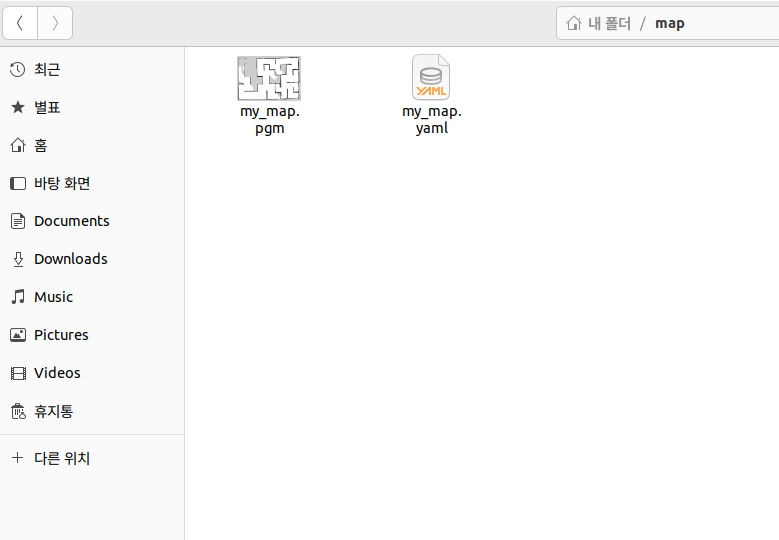

# Cartographer & Mapping

__현 단계에서는 Cartographer 패키지를 이용한 맵핑을 다룹니다.__

---

# Environment (세팅 환경)


# Installation
```bash

mkdir -p ~/ros2_ws/src
cd ~/ros2_ws/src

sudo apt update
sudo apt install ros-humble-cartographer* -y

git clone https://github.com/dkzpdhtm12/rviz_gazebo_test.git
git clone https://github.com/dkzpdhtm12/Cartographer_test.git

sudo apt update

cd ~/ros2_ws

rosdep update
rosdep install -i --from-path src --rosdistro humble -y

colcon build -- symlink-install
source ~/ros2_ws/install/local_setup.bash

ros2 launch rviz_gazebo car_lidar_gazebo.launch.py

ros2 launch test_cartographer cartographer.launch.py
```

Try mapping by moving the object.

```bash
sudo apt update
sudo apt install ros-humble-teleop-twist-keyboard -y

ros2 run teleop_twist_keyboard teleop_twist_keyboard
```

## Map save

맵이 그려졌다고 판단된다면 아래 명령어를 입력하여 맵을 저장하시면 됩니다.

성공했다면 아래 이미지 처럼 pgm 파일과 yaml 파일이 출력됩니다.

```bash
ros2 run nav2_map_server map_saver_cli -f <map name>
```



